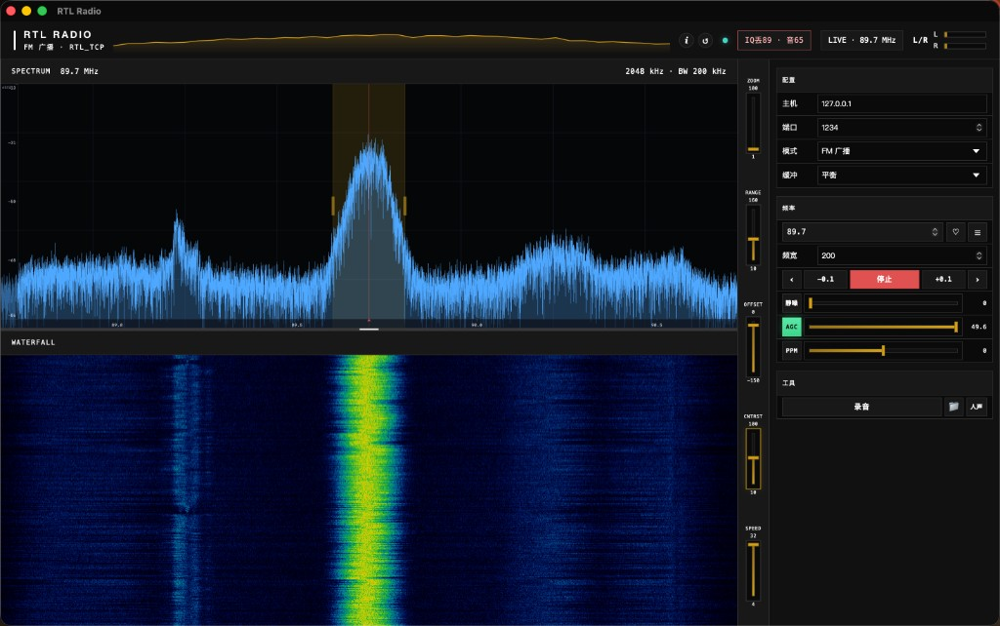

# 测试与兼容性说明

作者为**业余开发者**（业余无线电爱好者），非专业软件团队。本项目在业余时间维护，**仅在个人设备上做过验证**；其他平台与硬件组合不保证可用，但欢迎试用并反馈。

## 作者实测环境（仅此组合验证）

| 项目 | 配置 |
|------|------|
| **客户端** | macOS（Apple Silicon），RTL Radio 1.0.0（Tauri 构建） |
| **SDR 硬件** | RTL2838U（RTL-SDR） |
| **连接方式** | 远端 Linux 主机运行 `rtl_tcp`，本机通过局域网 / SSH 隧道连接 `host:1234` |
| **已测模式** | WBFM、NFM（火腿）、AM（航空）、USB/LSB |
| **已测功能** | 收听、频谱/瀑布、静噪、搜台、立体声录音、人声自动录、收藏 |

## 未测试 / 不保证

| 项目 | 说明 |
|------|------|
| **Windows 客户端** | 已提供构建产物，**作者未在 Windows 上实测**；若有问题请提 Issue |
| **Linux 客户端** | 已提供构建产物，**作者未在 Linux 桌面上实测** |
| **其他 RTL 设备** | 仅 RTL2838 系列；其他芯片、多通道 SDR、Airspy、HackRF 等**未测试** |
| **本机直插 USB** | 客户端设计为 `rtl_tcp` 网络协议；本机直插需自行运行 `rtl_tcp` 或转发 |
| **公网 / 高延迟链路** | 远距离转发可用「稳定」缓冲预设，极端网络下可能断续 |

## 反馈

有问题或建议请到 [GitHub Issues](https://github.com/liwei19920307/rtl-radio/issues) 提交，作者会尽量回复。请在 Issue 中注明：**操作系统、CPU 架构、RTL 型号、rtl_tcp 部署方式、模式与频率**，便于复现。

## macOS：从 Releases 下载后提示「已损坏」

**不是包坏了，也不是 ARM / Intel 架构不匹配。** GitHub Actions 在 Apple Silicon（arm64）上构建 DMG，与 M 系列 Mac 一致；Intel Mac 可通过 Rosetta 运行。

原因是：从浏览器下载后，macOS 会给应用打上**隔离（quarantine）**标记，而本项目**未做 Apple 开发者签名与公证**（需付费开发者账号），系统可能误报「已损坏，无法打开」。**换成 DMG 安装包并不能完全避免此问题。**

**安装步骤：**

1. 双击 `.dmg`，将 `RTL Radio.app` 拖入「应用程序」
2. 若无法打开，任选其一：
   - 终端：`xattr -cr "/Applications/RTL Radio.app"`
   - 右键应用 → **打开**（首次），在弹窗中确认

本地 `./install-client.sh` 安装脚本已自动执行 `xattr -cr`，因此本机编译安装一般不会出现此问题。
